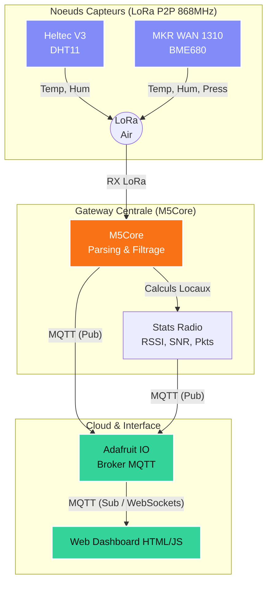

# 🚀 Projet IoT : Architecture Hybrid LoRa P2P & Cloud
> Projet de fin d'études en ingénierie informatique (2026). Surveillance environnementale multi-nœuds avec passerelle WiFi/MQTT.

   

## 📖 Présentation du Projet
Ce système déploie un réseau local **LoRa P2P** hybride permettant de collecter des données environnementales (Température, Humidité, Pression) depuis plusieurs émetteurs vers une passerelle centrale (Gateway), qui assure ensuite le pont vers le Cloud (Adafruit IO) et une interface web temps-réel.

  

---

## 🏗️ Architecture Matérielle

| Appareil | Rôle | Capteurs | Particularité |
|---|---|---|---|
| **M5Core (Gateway)** | Passerelle WiFi/MQTT | - | Bridge LoRa -> Cloud + LCD de contrôle |
| **MKR WAN 1310** | Nœud LoRa Émetteur | BME680 | Support de la pression atmosphérique |
| **Heltec V3** | Nœud LoRa Émetteur | DHT11 | Écran OLED avec interface glissante |
| **Web Dashboard** | Interface Monitoring | - | Dual-source (Cloud / Local Direct) |

### 🗺️ Schéma Détaillé de l'Architecture

  

---

## 📅 Historique Technique & Développement

### Phase 1 : Prototypage & Initialisation
- Définition du protocole de communication LoRa P2P (EU868, SF12, BW125).
- Premier bridge LoRa/WiFi sur ESP32 simple.

### Phase 2 : Migration Gateway & Stabilisation
- Migration vers **M5Unified** pour le M5Core (Meilleure gestion LCD et Son).
- Implémentation du **Safe Mode** : Protection contre les crashs lors de réception de paquets malformés.

### Phase 3 : Nouvelle Interface Web (Glassmorphism)
- Refonte complète du Dashboard Web pour un rendu premium.
- Ajout de la configuration d'IP dynamique via l'interface UI (LocalStorage).
- Implémentation de l'analyse radio (RSSI/SNR).

### Phase 4 : Résolution Hardware
- Correction du boot-loop électrique sur le MKR WAN 1310 (Inversion de l'init matériel).
- Création du menu OLED dynamique sur le Heltec V3.

---

## 🐞 Issues & Suivi (GitHub)

**Issues Résolues (Historique) :**
- ✅ **#7** : Architecture Gateway (M5Core) — Bruits parasites corrigés (`M5.Speaker.end()`).
- ✅ **#8** : Crash MKR WAN 1310 — Ordre d'initialisation SPI/I2C corrigé.
- ✅ **#9** : CORS local bloqué — Contourné par le relais MQTT Cloud.
- ✅ **#10** : SenseCAP ESP_ERR_NO_MEM — Activation `OPI PSRAM` réussie.

**Issues Ouvertes (Pour la suite) :**
- 🚨 **#14 (MAJEURE)** : Portage complet et développement de l'UI finale sur le **SenseCAP Indicator** (tests préliminaires valides dans `TEST_SENSECAP/`).
- 📌 **#11** : Sécurité des clés Adafruit IO dans le JS (À passer en backend/`.env`).
- 📌 **#12** : Déploiement statique du Dashboard Web (ex: Vercel/GitHub Pages).
- 📌 **#13** : Réactivation de la carte Pression (BME680) commentée.

---

## 🚀 Utilisation & Démo
1. **Gateway** : Connecter le M5Core au hotspot WiFi et noter l'IP sur l'écran.
2. **Dashboard** : Ouvrir `web_dashboard.html` et configurer l'IP via l'icône ⚙️.
3. **Observation** : Les colonnes "Cloud" et "Live LoRa" se mettent à jour automatiquement.

---

## 📚 Documentation & Ressources Annexes

Afin de faciliter la compréhension du matériel et des recherches approfondies menées durant ce projet, plusieurs ressources sont à disposition dans le dépôt :

- 📄 **[`COMPONENTS_DATASHEETS.md`](./COMPONENTS_DATASHEETS.md)** : Spécifications techniques et câblages des différents capteurs (DHT11, BME680) et modules LoRa.
- 🔍 **[`REVERSE_ENGINEERING.md`](./REVERSE_ENGINEERING.md)** : Notes d'ingénierie inverse et exploration de l'architecture matérielle complexe (notamment pour le SenseCAP).
- 📁 **`PJ-DOCS/`** : Pièces jointes, schémas bruts et documentations officielles PDF.
- 🧪 **`TEST_SENSECAP/`** : Ébauches de tests en R&D (`I2C_Scanner`, `HelloWorld_Display`) et logs de recherche. Ce dossier est crucial pour comprendre comment l'écran SenseCAP Indicator a été dompté pas à pas.

---

## 👨‍🎓 Guide de Reprise (Pour Étudiants / Stagiaires)

Ce projet a été conçu pour être modulaire et facilement reprenable. Voici les clés pour comprendre l'existant et continuer le développement sans tout casser.

### 1. Architecture Globale (L'Existant)
Le système fonctionne selon un modèle **Hub-and-Spoke** local (LoRa) couplé à une remontée Cloud (MQTT).

### 2. Comment naviguer dans le code ?
- **`LoRa_Sender_HeltecV3/` et `LoRa_Sender_MKR-WAN-1310/`** : Contiennent le code C++ des émetteurs. Le payload est une simple chaîne formatée (ex: `Temp=22.5,Hum=45.0`).
- **`LoRa_Receiver_M5Core/`** : Le cerveau local. Écoute le réseau LoRa (`LoRa.parsePacket()`), parse les Strings reçues, calcule les performances radio (RSSI/SNR), et pousse tout vers le Cloud en MQTT.
- **`web_dashboard.html`** : L'interface est un fichier statique ("Serverless"). Pas de base de données, pas de backend NodeJS. Le navigateur client se connecte directement aux WebSockets d'Adafruit IO.

### 3. Comment ajouter un nouveau capteur ?
1. **Hardware** : Programmez un microcontrôleur avec puce LoRa pour lire votre capteur.
2. **Format d'envoi** : Envoyez le payload en LoRa P2P. Respectez le format attendu par le M5Core (ex: `MonNouveauNoeud|Temp=X,Hum=Y`).
3. **Gateway (M5Core)** : Dans `LoRa_Receiver_M5Core.ino`, ajoutez un bloc de parsing pour détecter votre nœud et extraire ses données spécifiques.
4. **Dashboard & Cloud** : Créez un nouveau "Feed" sur Adafruit IO, publiez-le depuis le M5Core, et dédupliquez une carte existante dans `web_dashboard.html` (HTML + ajout du `mqttC.subscribe()`).

### 4. Pièges à éviter (Lessons Learned)
- **SenseCAP Indicator (PSRAM)** : Le développement sur la carte SenseCAP Indicator a nécessité d'activer l'option `OPI PSRAM` dans l'IDE Arduino. Sans cela, le code crashe avec l'erreur `ESP_ERR_NO_MEM`. C'est une erreur classique sur les ESP32-S3 lourds en graphique.
- **Isolation Réseau & IP Locales** : iOS/Android bloquent souvent les communications P2P sur les points d'accès mobiles (isolation client). C'est pour ça que la section "Radio" du tableau de bord utilise le **repli MQTT Cloud** pour contourner ce blocage.
- **La carte Pression (BME680)** : Elle est actuellement **commentée** dans le code HTML pour épurer l'interface (suite aux demandes de la soutenance). Si vous réutilisez le BME680, décommentez simplement le code dans `web_dashboard.html` et `LoRa_Receiver_M5Core.ino`.
- **Limites Adafruit IO (Throttling)** : Le compte gratuit Adafruit limite à **30 requêtes par minute**. Ne configurez pas vos émetteurs LoRa pour envoyer des paquets toutes les secondes, sinon le M5Core sera bloqué temporairement. Un envoi toutes les 5 à 10 secondes est optimal.
